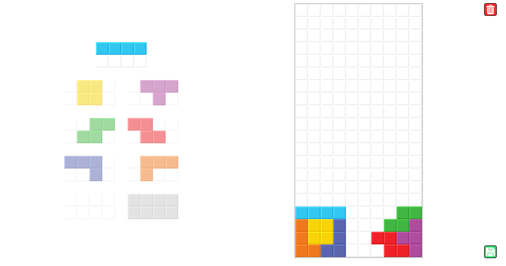

# Tetris Drawer

A simple web application to draw and save Tetris matrixes. I made this tool to
demonstrate and explain various setups and playstyles. Everything is contained
within a single HTML file. The visual design is inspired by
[Hard Drop](https://harddrop.com/).

Try it out: 

## Usage

1. **Select a color**: Click on a Tetromino to choose its color.
2. **Draw the matrix**: Click and drag inside the Tetris grid to create your
   matrix. Your progress is automatically saved to your browser's local storage,
   so you won't lose your work when closing the page.
3. **Save the matrix**: Click the save button
   
   to download the Tetris matrix as a PNG file.
4. **Clear the matrix**: Click the trash button
   
   to clear the Tetris matrix.
